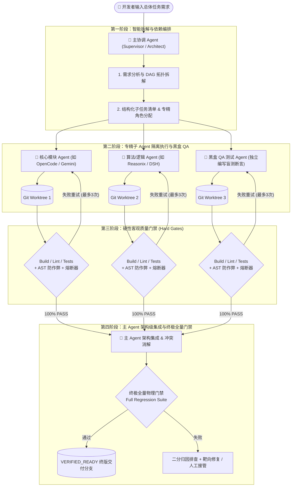

# AgentRace (arace) 2.0

> **主 Agent 智能编排分工 + 专精子 Agent 协同 + 硬性客观质量门禁引擎**
> 基于物理级 Git 工作树隔离、黑盒 QA 契约盲测、AST 防作弊审查与全量终极物理门禁，让多个本地 AI Agent（Antigravity/Gemini、OpenCode、Reasonix、OpenClaw、DSH、Claude、Codex）在严苛质量护栏下可靠协同交付。数据 100% 留在本地。

---

## 🌟 核心架构与设计哲学

AgentRace 坚守 **"不信自我汇报，只信物理验证"（Zero-Trust Self-Reporting, Physical Verification Only）**：



---

## 🛡️ 六大可靠性闭环机制

1. **主 Agent 智能编排分工（Supervisor Orchestration - 默认主推）**：
   - 主协调 Agent 将复杂需求拆解为包含 `domain_architect`、`backend_developer`、`qa_engineer` 专精角色的 DAG 拓扑。
2. **黑盒 QA 契约物理隔离（Black-box Specification Isolation）**：
   - QA Agent 的 Prompt 中**物理剥离开发者的实现源码**，仅提供需求规格、接口签名与验收标准，杜绝同源盲区与迎合造假。
3. **断言密度与非平凡检测（Non-trivial Assertion Check）**：
   - 静态扫描测试文件，拦截仅有 `assert.ok(true)` 或无实质断言的虚假测试。
4. **带诊断反馈的重试熔断器（MAX_ATTEMPTS = 3）**：
   - 1 次初始尝试 + 最多 2 次带精确 `stderr` 堆栈反馈的重试；超过 3 次立即熔断报警，防止死循环消耗 Token。
5. **终极集成全量门禁（Final Integration Gate）**：
   - 主 Agent 集成代码后必须在独立工作树强制跑通全量回归测试，主 Agent 无权豁免。
6. **故障二分归因（Failure Bisection）**：
   - 集成失败时自动定位跨模块破坏点，支持 1 次靶向修复与现场保留转人工。

---

## 🚀 快速开始

### 1. 核心命令一览

```bash
# 启动 Web 可视化编排工作台 (默认智能编排模式)
arace ui

# 命令行发起主 Agent 智能编排分工 (默认模式)
arace orchestrate "优化 Redis 连接池并发超时重试机制" --supervisor antigravity --with opencode,reasonix

# 命令行发起多 Agent 锦标赛竞速打擂 (基准选型模式)
arace run "戳气球区间 DP 最优解" --with antigravity,opencode

# 探测本地可用 Agent 客户端与后台进程
arace detect

# 环境自检与工作树诊断
arace doctor

# 查看工作树代码 Diff 与安全审计评分
arace diff

# 🤖 主 Agent 统筹融合最佳特性
arace blend --judge antigravity

# 一键合并终版方案并清理临时沙盒
arace keep supervisor

# 查看历史协同与战绩画像
arace stats
```

---

## 📊 终端事实看板 (Terminal Dashboard)

```text
ORCHESTRATION PIPELINE (Run ID: 539610)
Supervisor: ANTIGRAVITY | Mode: Specialist Orchestration
Task: "优化 Redis 连接池并发锁超时与自动重试机制"
━━━━━━━━━━━━━━━━━━━━━━━━━━━━━━━━━━━━━━━━━━━━━━━━━━━━━━━━━━━━━━━━━━━━━━━━━━━━
Subtask     Role                 Agent         Attempts   Gate Status   Diff
subtask-1   domain_architect     antigravity   1/3        ✓ PASS        +38 / -0
subtask-2   backend_developer    opencode      1/3        ✓ PASS        +42 / -10
subtask-3   qa_engineer (Blind)  reasonix      1/3        ✓ PASS (100%) +28 / -0
────────────────────────────────────────────────────────────────────────────
[Final Integration Gate]
Supervisor  Architecture Merge   antigravity   1/1        ✓ ALL PASS    +108 / -10
━━━━━━━━━━━━━━━━━━━━━━━━━━━━━━━━━━━━━━━━━━━━━━━━━━━━━━━━━━━━━━━━━━━━━━━━━━━━

Commands:
  → arace diff            Show full unified diff & test suite
  → arace keep supervisor Merge integrated solution to current branch
  → arace discard         Discard all temporary worktrees
```

---

## ⚙️ 项目级配置 (`.arace.yaml`)

```yaml
version: 2

# 工作树隔离与依赖配置
workspace:
  prepare_cmd: "npm install"
  test_paths:
    - "test/**"
    - "tests/**"
    - "src/**/*.spec.ts"
    - "src/**/*.test.js"

# 独占硬性门禁流水线
verify:
  build_cmd: "npm run build"
  lint_cmd: "npm run lint"
  test_cmd: "npm test"
  timeout_per_step: 180s

# 默认协同参数
defaults:
  mode: orchestration
  supervisor: antigravity
  agents:
    - antigravity
    - opencode
    - reasonix
  timeout: 600s
```

---

## 🔒 安全与隔离机制声明

1. **Git Ref 与 Agent 命名安全白名单**：
   - 为防御命令注入，所有分支名、Agent 标识符（`name` / `id`）与 Commit Target 必须严格符合正则白名单 `/^[\w][\w./-]*$/`（仅支持 ASCII 字母、数字、下划线、短横线与点号）。非 ASCII 自定义名称请通过 `displayName` 属性展示。
2. **工作树依赖共享（Shared Dependencies Mode）**：
   - 调度引擎为隔离 Worktree 初始化依赖时，优先尝试系统级 Copy-on-Write（macOS APFS Clone / Linux Reflink），在 Windows 上自动使用 NTFS Junction 目录连接（`sharedDepsLinked`），兼具零秒就绪与免磁盘膨胀优势。
   - *注意*：若构建流水线中包含会就地修改 `node_modules` 的非常规操作，共享依赖存在潜在并发冲突风险；可通过 `.arace.yaml` 的 `workspace.prepare_cmd` 指定专属准备命令。
3. **适配器参数安全与自定义命令规范**：
   - 所有内置适配器均采用裸参数数组（去 Shell 化）调用，彻底杜绝特殊字符注入与 Node.js `DEP0190` 警告。用户自定义适配器（CustomAdapter）命令将经 shell 执行，请勿配置不可信来源。

---

## 🧪 自动化测试套件

AgentRace 自带完备的自动化测试体系，包含 **40 个** 单元与集成测试用例：

```bash
npm test
```

- `supervisor.test.js`: DAG 动态拆解、黑盒 QA 契约盲测、目标断言密度检查与级联 Worktree 继承验证
- `ast_guard.test.js`: AST 防作弊与 `test.skip` 侦测验证
- `blend.test.js`: AI 裁判与方案融合验证
- `diff_parser.test.js`: 业务代码与测试代码分流解析
- `cli.test.js` & `ui.test.js`: 命令行与 Web 服务接口验证
- `db.test.js`: 本地 SQLite 遥测与统计持久化验证
- `config.test.js`: 引号感知的 YAML 注释状态机与项目配置解析
- `utils.test.js`: 16 字符高熵 RunId 生成与 Git Ref 防注入断言

---

## 📄 License

MIT © 2026 AgentRace Team